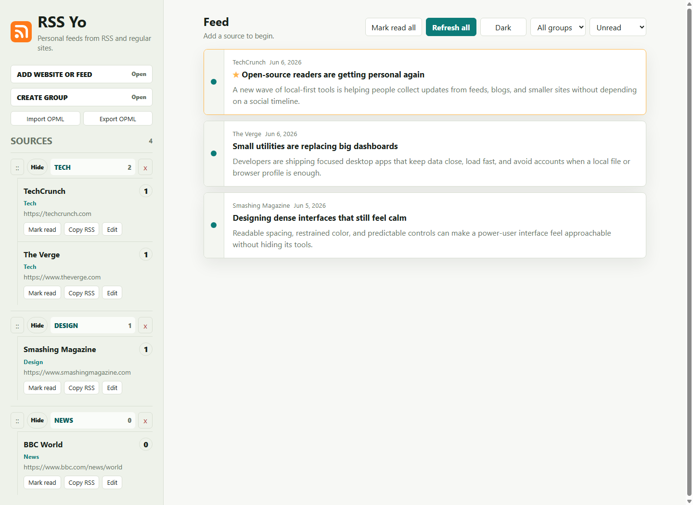
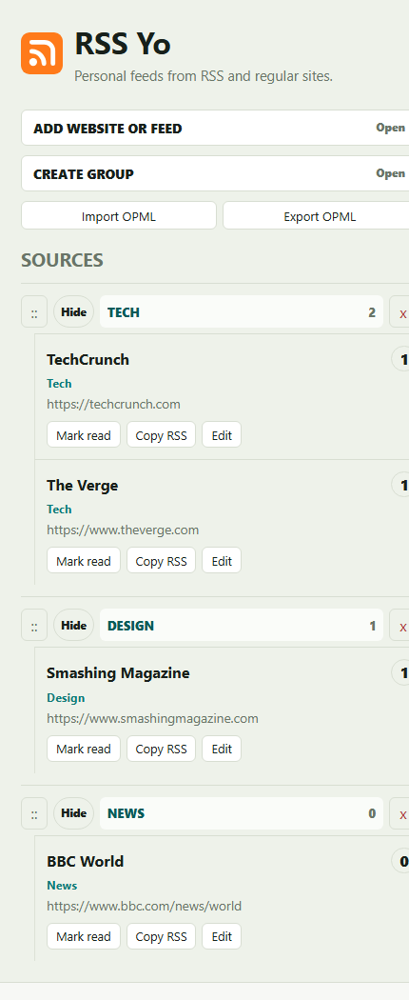

# RSS Yo

RSS Yo is a local-first RSS reader and lightweight RSS generator for personal use. Add normal RSS/Atom feeds, paste regular website URLs, organize everything into groups, and read posts from one clean interface.

It runs on your own machine with a small Node/Express server. There is no login, no hosted database, and no cloud account required. Your sources, groups, read state, favorites, theme, and posts are saved in browser `localStorage`.



## What It Does

RSS Yo gives you three practical tools in one app:

- **RSS reader**: follow feeds you already know.
- **Feed finder**: paste a normal website URL and let RSS Yo look for RSS/Atom links.
- **RSS generator**: when a site has no feed, RSS Yo extracts likely article links and turns them into an internal RSS-style feed.

## Highlights

- Add direct RSS/Atom URLs or regular website URLs.
- Auto-discover feeds from `<link rel="alternate">` tags.
- Try common feed paths like `/feed`, `/rss`, `/rss.xml`, `/atom.xml`, and `/feed.xml`.
- Scrape article links from websites that do not publish RSS.
- Read posts in a clean newest-first feed.
- Filter by **Unread**, **All**, **Read**, or **Favorites**.
- Right-click posts to mark read/unread or add/remove favorites.
- Mark all visible posts as read.
- Create groups and move sources between them.
- Reorder, collapse, expand, and delete groups.
- Show unread counts for groups and sources.
- Import grouped OPML from Feedly, Inoreader, and similar readers.
- Export your current sources as OPML.
- Copy generated RSS XML for any followed source.
- Toggle light mode and true black/white dark mode.
- Run in a browser locally or build a portable Windows desktop app with Electron.

## Screenshots

### Main Reader


### Narrow Layout



## Core Workflow

1. Start RSS Yo locally.
2. Add a feed URL, website URL, or import OPML.
3. Put sources into groups such as News, Tech, Blogs, or Design.
4. Refresh all sources when you want new posts.
5. Read posts, mark them read, and favorite items you want to keep close.
6. Export OPML or copy generated RSS XML when needed.

## Groups, Sources, And Favorites

**Groups** keep sources organized. You can create groups, reorder them, collapse them, delete them, and click a group name to view unread posts from that group.

**Sources** are the websites or feeds you follow. Each source can be refreshed, moved to another group, marked read, deleted, or copied as RSS XML.

**Favorites** are saved posts. Right-click a post and choose `Add favorite`; use the read-state dropdown to switch the feed to `Favorites`.

## Setup

Install dependencies:

```bash
npm install
```

Start the local app:

```bash
npm run dev
```

Open:

```text
http://localhost:5173
```

On Windows, you can also double-click:

```text
start-rss-yo.bat
```

The batch file installs dependencies if needed, starts the local server, and opens the app in your browser.

## Windows Desktop App

Build a portable Windows `.exe` with Electron:

```bash
npm run dist:win
```

The generated app is written to:

```text
release/RSS-Yo-1.0.0-portable.exe
```

The desktop app starts its own local Express server on:

```text
http://127.0.0.1:51733
```

For development without packaging:

```bash
npm run desktop
```

## Project Structure

```text
rss-yo/
  public/
    assets/
      rss-yo-logo.svg
    app.js
    index.html
    styles.css
  docs/
    screenshots/
      rss-yo-reader.png
      rss-yo-mobile.png
      rss-yo-preview.svg
  electron/
    main.js
  scripts/
    create-windows-icon.js
  tests/
    server.test.js
    smoke.test.js
  server.js
  package.json
  start-rss-yo.bat
```

## Scripts

```bash
npm run dev
```

Starts the local Express server on `http://localhost:5173`.

```bash
npm run desktop
```

Starts the Electron desktop wrapper.

```bash
npm run dist:win
```

Builds the portable Windows app in `release/`.

```bash
npm test
```

Runs the test suite with Node's built-in test runner.

## How Discovery Works

When you add or refresh a source, RSS Yo:

1. Normalizes the URL.
2. Tries the URL as a direct RSS/Atom feed.
3. Looks for feed links on the homepage.
4. Tries common feed paths.
5. Parses the discovered feed with `rss-parser`.
6. If no feed works, extracts likely article links with `cheerio`.
7. Canonicalizes URLs and avoids duplicate posts.

## Data Storage

RSS Yo stores data in browser `localStorage` under:

```text
rss-yo-state-v1
```

Stored data includes:

- followed sources;
- discovered posts;
- groups and group order;
- collapsed/expanded group state;
- read/unread state;
- favorites;
- selected theme.

Clearing browser site data will remove saved RSS Yo data.

## Tests

Run all tests:

```bash
npm test
```

The tests cover server feed discovery helpers, article extraction heuristics, required UI controls, dark theme styles, group UI, and logo/favicon wiring.

## Limitations

- Scraping is best-effort.
- Websites can block local server requests.
- JavaScript-rendered sites may not expose article links in fetched HTML.
- Dates and excerpts depend on feed data or page markup.
- Generated RSS XML is copied locally; it is not hosted as a public feed URL in v1.
- Data is local to one browser profile or Electron app profile.

## Notes

Static hosting alone is not enough for full functionality because `/api/discover` needs the Node/Express server. For hosted deployment, use Node hosting or convert the API route to serverless functions.
