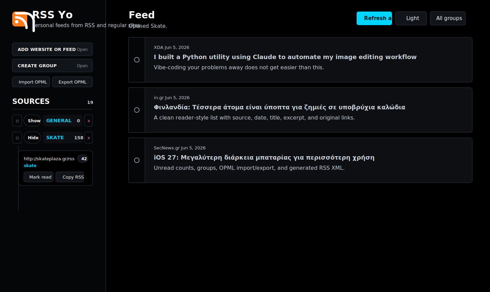

# RSS Yo

RSS Yo is a self-hosted personal RSS reader and RSS generator. It lets you follow normal RSS/Atom feeds and regular websites that do not publish RSS, then read everything in one clean feed-style interface.

The app is built for local-first personal use: no login, no database, and no cloud dependency. Sources, groups, posts, theme, and read/unread state are stored in your browser with `localStorage`.



## What It Does

RSS Yo combines three related tools:

- A personal RSS reader for feeds you already follow.
- A feed discovery tool that tries to find RSS/Atom feeds from normal website URLs.
- A simple browser-side RSS generator for sites that do not provide RSS.

When a website does not expose a feed, RSS Yo falls back to article-link extraction and builds an internal RSS-style XML feed from discovered posts.

## Features

- Add website URLs or direct RSS/Atom feed URLs.
- Keep add-source and create-group controls collapsed until needed.
- Detect feeds through homepage `<link rel="alternate">` tags.
- Try common feed paths: `/feed`, `/rss`, `/rss.xml`, `/atom.xml`, `/feed.xml`.
- Scrape likely article links from non-RSS websites.
- Show posts in a clean reader UI with source, date, title, excerpt, and original link.
- Open posts in a new tab.
- Mark posts read/unread manually.
- Mark posts read on hover.
- Mark posts read automatically as they pass through the reading view.
- Right-click a post to mark it read/unread or add/remove it from Favorites.
- Filter posts by All, Unread, or Read.
- Filter posts by Favorites.
- Refresh all sources and add only new posts.
- Deduplicate posts by canonical URL.
- Import OPML from Feedly, Inoreader, and similar readers.
- Preserve OPML folders as groups.
- Create, reorder, expand/collapse, and delete groups.
- Show unread counts for groups and individual sources.
- Keep per-source group changes and deletion inside a compact Edit panel.
- Click a group name/count to show unread posts from that group.
- Move existing sources between groups from each source's Edit panel.
- Mark every post in a source as read.
- Export current sources as grouped OPML.
- Copy generated RSS XML for any followed source.
- Toggle light mode and true black/white dark mode.
- Use a custom orange RSS logo as the app header mark and browser favicon.
- Run locally with `npm install` and `npm run dev`.
- Windows launcher included: `start-rss-yo.bat`.

## Project Structure

```text
rss-yo/
  public/
    assets/
      rss-yo-logo.svg
    app.js
    index.html
    styles.css
  docs/
    screenshots/
      rss-yo-preview.svg
  tests/
    server.test.js
    smoke.test.js
  MEMORY.md
  README.md
  package.json
  server.js
  start-rss-yo.bat
```

## Setup

Install dependencies:

```bash
npm install
```

Start the local app:

```bash
npm run dev
```

Open:

```text
http://localhost:5173
```

On Windows, you can double-click:

```text
start-rss-yo.bat
```

The batch file installs dependencies if needed, starts the local Node server, and opens the app in your browser. Keep that terminal window open while using RSS Yo.

## Why A Server Is Needed

The UI is plain HTML, CSS, and JavaScript, but RSS/feed discovery needs a small local server.

If you double-click `public/index.html` directly, the page may load, but adding websites and refreshing feeds will not work reliably because:

- browsers block many cross-site requests with CORS;
- `/api/discover` only exists when the Node/Express server is running;
- scraping websites from browser-only JavaScript is unreliable.

The Express server acts as a local fetcher/parser so the browser can ask your own local backend to read external feeds and pages.

## How Discovery Works

When you add or refresh a source, RSS Yo:

1. Normalizes the URL.
2. Tries the input URL as a direct RSS/Atom feed.
3. Fetches the homepage if the input URL is not a feed.
4. Looks for `<link rel="alternate">` RSS, Atom, or XML feed links.
5. Tries common feed paths:

```text
/feed
/rss
/rss.xml
/atom.xml
/feed.xml
```

6. Parses a discovered feed with `rss-parser`.
7. If no feed works, extracts likely article links with `cheerio`.
8. Canonicalizes URLs and avoids duplicates.

## Article Extraction

For sites without RSS, RSS Yo looks for article-like links from:

- `<article>` elements;
- links inside `main`, `[role="main"]`, `.content`, `#content`, `.post`, `.entry`, and `.article`;
- URLs that include dates or article-like paths;
- `<time>` elements and dates found in URLs.

It tries to avoid navigation, footer, sidebar, login, search, tag, privacy, and other utility links.

This is best-effort, not magic. Sites with heavy JavaScript rendering, bot protection, unusual markup, or paywalls may return few or no posts.

## Reader Behavior

Posts are sorted newest-first when dates are available. Each post shows:

- title;
- source site;
- date when available;
- excerpt when available;
- original URL.

Read state can change in several ways:

- click the read/unread circle;
- click the post link;
- hover over a post;
- scroll past a post until it is sufficiently visible;
- use `Mark read` on a source.
- right-click a post and choose `Mark unread` to bring it back.

Favorites can be toggled by right-clicking a post and choosing `Add favorite` or `Remove favorite`.

The toolbar filters the feed by:

- All;
- Unread;
- Read;
- Favorites;
- selected group.

## Groups And OPML

RSS Yo supports Feedly/Inoreader-style OPML import.

During import, it:

- reads feed URLs from `xmlUrl`, `htmlUrl`, or `url`;
- preserves parent OPML folders as groups;
- handles Feedly-style `category` values such as `Tech` or `/Tech`;
- creates groups before network refreshes so the sidebar tree appears immediately;
- matches existing feeds against imported feeds using canonical URL variants;
- moves existing sources into imported groups when possible.

Groups in the sidebar support:

- `Show` / `Hide` for expand/collapse;
- click group name/count to show unread posts from that group;
- drag handle `::` to reorder groups;
- delete button `x`;
- unread count badge.

If a deleted group contains sources, those sources move to another available group. If the last group is deleted, RSS Yo creates an `Ungrouped` fallback.

## RSS Output

Each followed source has a `Copy RSS` button.

For normal RSS/Atom feeds, this copies an RSS-style XML feed based on the posts RSS Yo has discovered.

For non-RSS websites, this effectively becomes a generated internal RSS feed from scraped article links. In v1, this XML is copied in the browser; it is not hosted as a public URL.

## Data Storage

RSS Yo stores data in browser `localStorage` under:

```text
rss-yo-state-v1
```

Stored data includes:

- followed sources;
- discovered posts;
- groups and group order;
- collapsed/expanded group state;
- read/unread state;
- selected theme.

Clearing browser site data will remove your saved RSS Yo data.

## Scripts

```bash
npm run dev
```

Starts the local Express server on `http://localhost:5173`.

```bash
npm start
```

Runs the same server entrypoint.

```bash
npm test
```

Runs the full test suite with Node's built-in test runner.

## Tests

The project includes smoke and regression tests.

Regression tests cover:

- URL normalization;
- canonical URL cleanup;
- feed link discovery;
- article extraction;
- article heuristics;
- date extraction.

Smoke tests cover:

- required HTML controls;
- client behavior hooks;
- dark theme and group styles;
- favicon/logo asset.

Run all tests:

```bash
npm test
```

Current expected result:

```text
10 tests passing
```

## Limitations

- Scraping is best-effort.
- Websites can block server-side requests.
- Sites rendered entirely by JavaScript may not expose article links in the fetched HTML.
- Dates and excerpts depend on what feeds or page markup provide.
- Generated RSS XML is copied locally and is not publicly hosted in v1.
- Data is local to one browser profile unless future sync is added.

## Deployment Notes

Static hosting alone is not enough for full functionality.

For example, Netlify static hosting can serve the UI, but the Express API will not run as-is. To deploy on Netlify, `/api/discover` would need to be converted to Netlify Functions.

Node hosting works more directly:

- Render;
- Railway;
- Fly.io;
- Koyeb;
- VPS;
- local PC.

For a future Windows `.exe`, the project decision recorded in `MEMORY.md` is to use Electron first, because it best matches the current HTML/CSS/JS plus Node/Express architecture.

## Development Notes

`MEMORY.md` is the project memory. It records behavior, design decisions, and workflow rules.

Before meaningful changes:

```bash
npm test
```

After changes:

```bash
npm test
```

Then update `MEMORY.md` when the behavior or project direction changes.
